Read this on my new website: [samanthaming.com/flexbox30/](https://www.samanthaming.com/flexbox30/)

# Flexbox30

Learn Flexbox in 30 days with 30 code tidbits ✨


## Table of Contents

1. [Introduction](#flexbox-intro)
1. [Flex Container & Flex Items](#flex-container-and-flex-items)
1. [Immediate Child Only](#immediate-child-only)
1. [Flexbox Axes](#flexbox-axes)
1. [Flexbox Module](#flexbox-module)
1. [Parent Properties](#parent-properties)
1. [Display](#display)
1. [block vs inline](#block-vs-inline)
1. [flex-direction](#flex-direction)
1. [flex-wrap](#flex-wrap)
1. [flex-flow](#flex-flow)
1. [justify-content [row]](#justify-content-row)
1. [justify-content [column]](#justify-content-column)
1. [space-around vs space-evenly](#space-around-vs-space-evenly)
1. [align-items [row]](#align-items-row)
1. [baseline](#baseline)
1. [align-items [column]](#align-items-column)
1. [align-content](#align-content)
1. [Child Properties](#child-properties)
1. [order](#order)
1. [flex-grow](#flex-grow)
1. [flex-grow calculation](#flex-grow-calculation)
1. [flex-shrink](#flex-shrink)
1. [flex-shrink calculation](#flex-shrink-calculation)
1. [flex-basis](#flex-basis)
1. [flex-basis vs widths](#flex-basis-vs-widths)
1. [flex](#flex)
1. [align-self](#align-self)
1. [Flexbox Properties](#flexbox-properties)
1. [Flexbox Cheatsheet](#flexbox-cheatsheet)
1. [Aligning with Auto Margins](#bonus-aligning-with-auto-margins)
1. [Resources](#resources)
1. [Say Hello](#say-hello)
1. [Download & Share](#download-and-share)
1. [Contribution](#contribution)
1. [License](#license)

## Flexbox Core Concepts

<a id="flexbox-intro"></a>

### [Day 1: Introduction](#flexbox-intro)

Before Flexbox, we were mainly using floats for layout. And for those CSS developers, we all know the frustrations and limitations of the old way -- especially the ability to vertically center inside a parent. Ugh, that was so annoying! Not anymore! Flexbox for the win!

<p>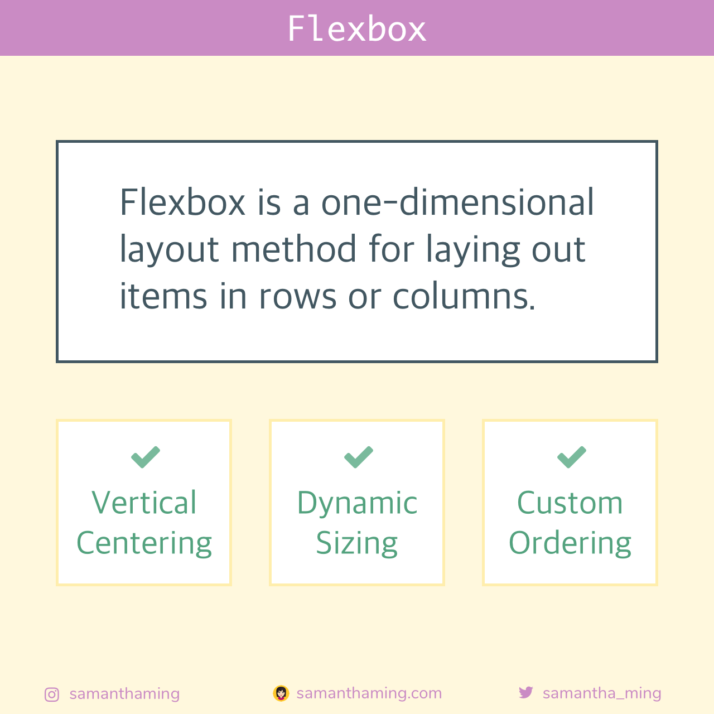</p>

<a id="flex-container-and-flex-items"></a>

### [Day 2: Flex Container & Flex Items](#flex-container-and-flex-items)

In order to get Flexbox to work, you need to set up the Parent-Child relationship. The parent is the flex container, and everything within it is the children or flex items.

<p>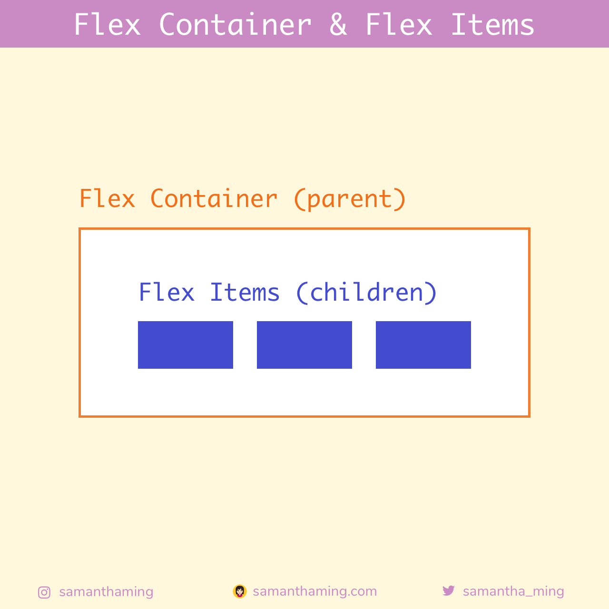</p>

<a id="immediate-child-only"></a>

### [Day 3: Immediate Child Only](#immediate-child-only)

One VERY important thing I want to point out is that the flex container only wraps around its immediate children. The flex container doesn't wrap beyond one layer deep. Only the immediate children. So there is NOT a grandchildren or grand-grandchildren relationship. Only Parent ↔️ Immediate Children!

Of course, you can establish a Flexbox as long as there is a parent-child relationship. So a child can also be the flex container to its children. But it will be a separate flex container. And it doesn't carry over the grandparent flex properties.

This is probably one of the most important concepts that helped me understand how Flexbox works. And knowing this will help solve a lot of those "hey, why isn't this working" moments 😅

<p></p>

<a id="flexbox-axes"></a>

### [Day 4: Flexbox Axes](#flexbox-axes)

Flexbox operates in a 2 axes system: a main and a cross axis. The main axis is your defining direction of how your flex items are placed in the flex container. Determining the cross axis is very simple, it's in the direction that's perpendicular to your main axis.

Remember in math class, we were taught **x** and **y** axis. Well, throw that out. Because the main axis can be horizontal or vertical. The **x** axis is not always the main axis. This was a mistake I made, so hopefully you won’t make the same incorrect assumption as I did 😅

<p>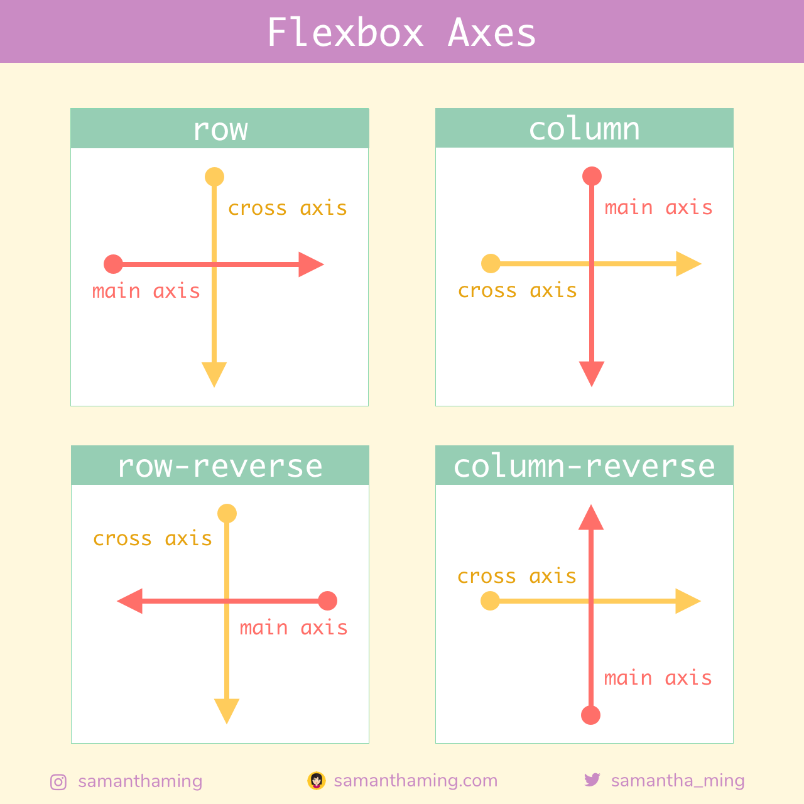</p>

<a id="flexbox-module"></a>

### [Day 5: Flexbox Module](#flexbox-module)

Let's zoom in on one of the layouts and check out the anatomy of our Flexbox. On each axis, there is a start and an end.  If it's on the main axis, the starting position is called **main start** and if the ending position is called **main end**. The same concept applies to the cross axis. Knowing your start and end is important because you can control where your flex items are placed.

And this concludes our Flexbox Fundamentals.

<p></p>

**[⬆ back to top](#table-of-contents)**

## Parent Properties

<a id="parent-properties"></a>

### [Day 6: Parent Properties](#parent-properties)

Now you know Flex operates in a Parent-Child relationship. So we have 2 entities involved to get this tango started. And each entity will have its own set of unique CSS properties that can be applied to them. That's why it's important that you know which element is the parent and which element(s) is the child. Let's get started with the parent properties 🤰

<p>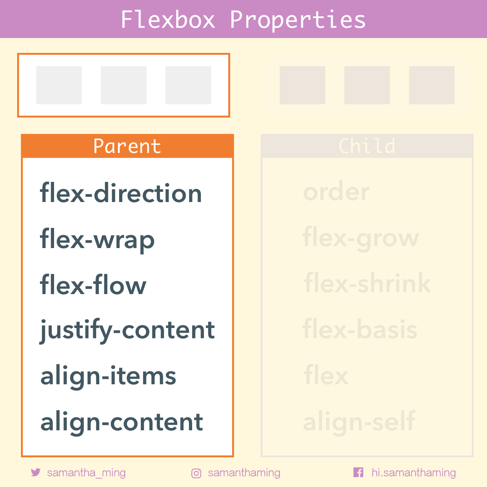</p>

<a id="display"></a>

### [Day 7: Display](#display)

To start this Flexbox party, we need to first create our flex container. This is done by applying `flex` to the `display` property on the parent element. Bam! Now all its immediate children will become flex items 🎊

There are 2 types of flex container: `flex` will create a *block* level flex container. And `inline-flex` will create an *inline* level flex container. More on *block* and *inline* tomorrow 😉

<p>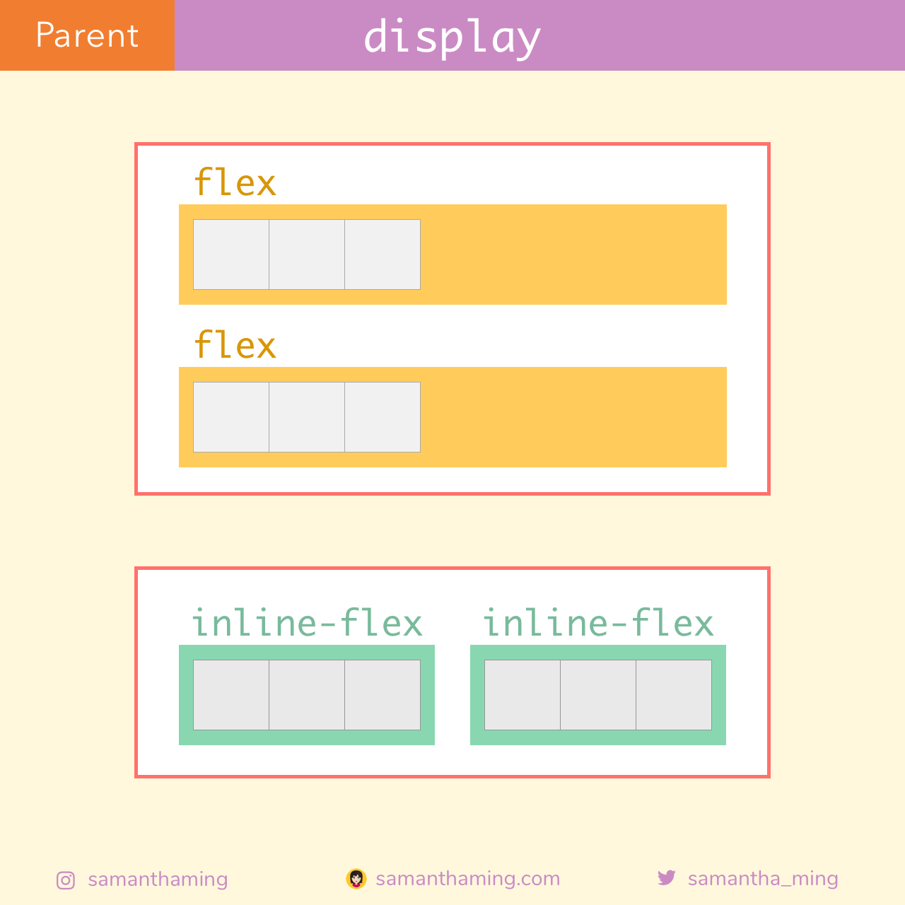</p>

```css
.parent {
  display: flex /* default */
        or inline-flex
}
```

<a id="block-vs-inline"></a>

### [Day 8: block vs inline](#block-vs-inline)

Very simply explained, `block` element takes up the entire width of the container. They look like building blocks where each block is stacked on each other. Whereas `inline` element only takes up the space it needs. So they appear to be in a line, or side by side of each other.

<p>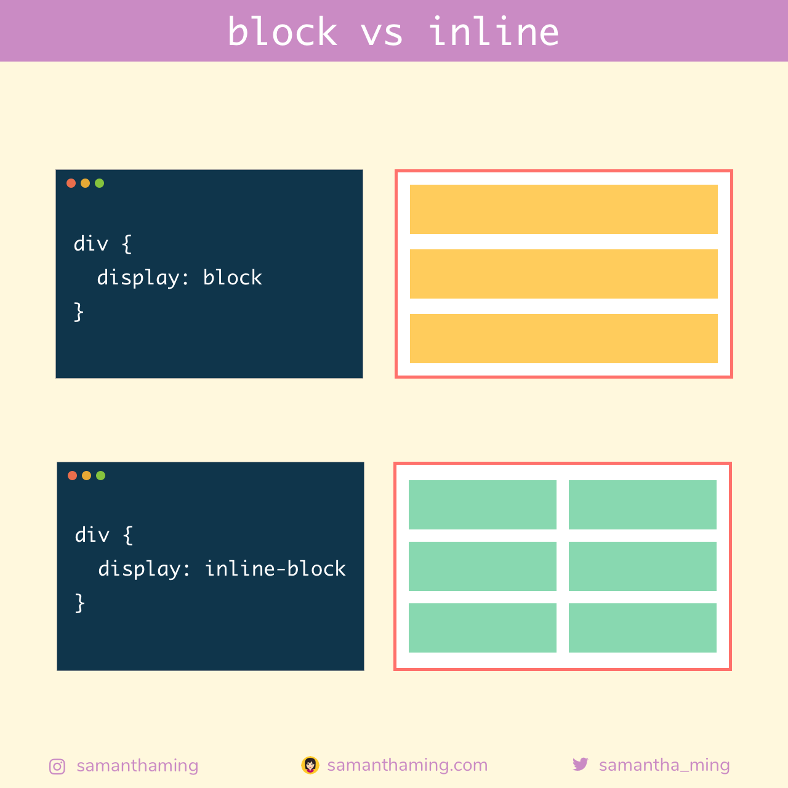</p>

<a id="flex-direction"></a>

### [Day 9: flex-direction](#flex-direction)

This is the property that allows us to define our main axis. Remember I mentioned that our main axis can be horizontal or vertical. So if we want the main axis to be horizontal, that's called **row**. And if we want it to be vertical, that's called **column**. Also, remember we had a **main start** and **main end**. We simply add a `reverse` suffix to set our "main start" in the reverse direction. Pretty cool eh 👍

<p>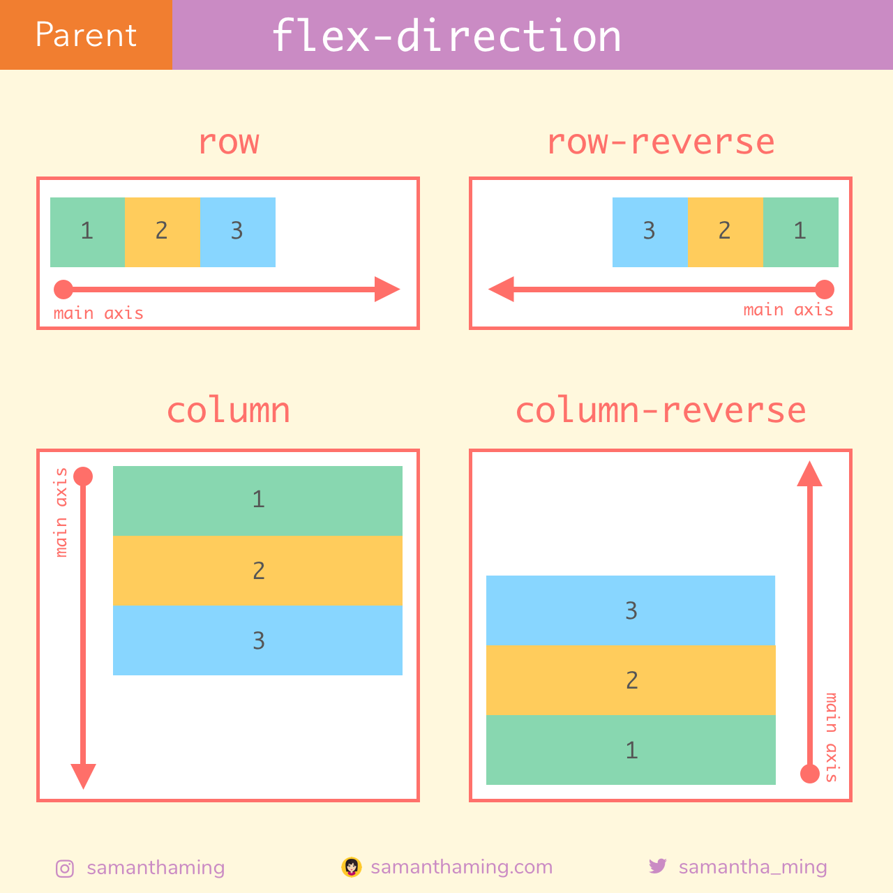</p>

```css
.parent {
  flex-direction: row /* default */
               or row-reverse
               or column
               or column-reverse
}
```

<a id="flex-wrap"></a>

### [Day 10: flex-wrap](#flex-wrap)

By default, flex items will try to shrink itself to fit onto one line, in other words, `no wrap`. However if you want the flex items to maintain its size and have the overflow spread on multiple lines in the containers, then you can turn on `wrap`.

This property is what will allow flex items in your container to occupy more than one line.

<p>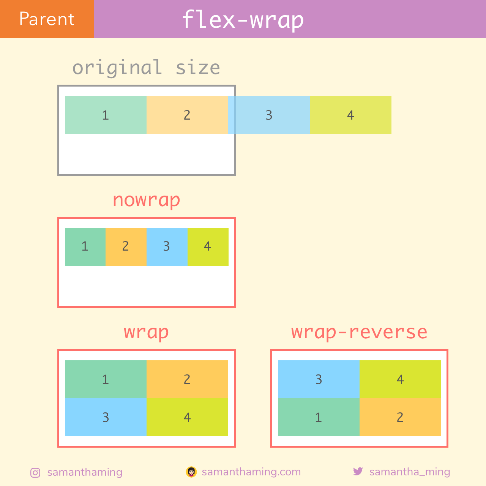</p>

```css
.parent {
  flex-wrap: nowrap /* default */
          or wrap
          or wrap-reverse
}
```

<a id="flex-flow"></a>

### [Day 11: flex-flow](#flex-flow)

So we've learned `flex-direction` and `flex-wrap`. If you understand those 2, you'll get `flex-flow`! Because it's just a shorthand for these two properties 👏

You can set both properties at the same time. Or you can just pass one of them. The default value is `row nowrap`. So if you just set one value, the property that you didn't set will just take on the default value.

<p>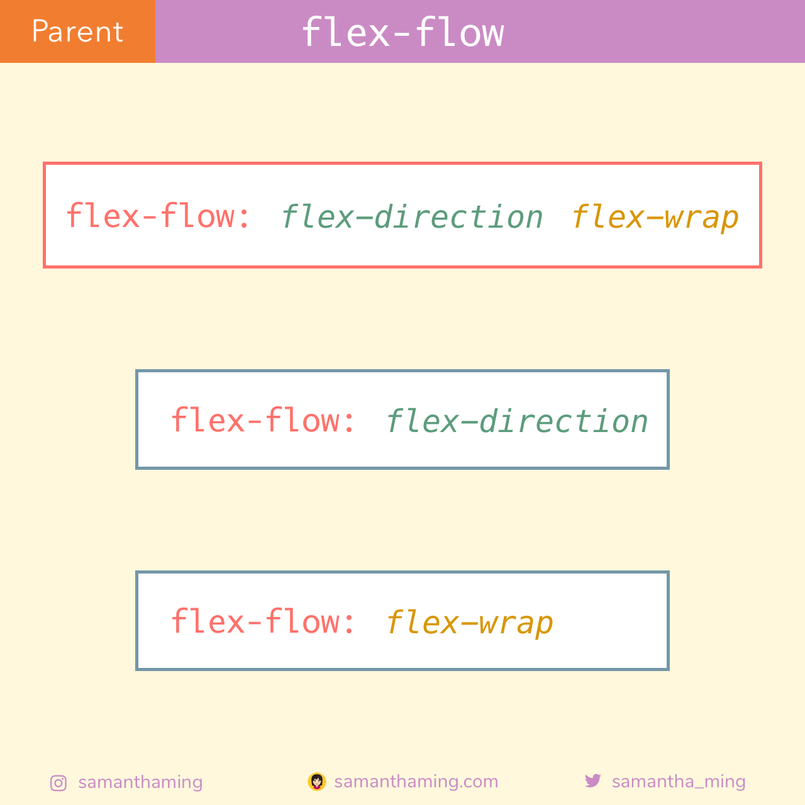</p>

```css
.parent {
  flex-flow: row nowrap /* default */
          or <flex-direction> <flex-wrap>
          or <flex-direction>
          or <flex-wrap>
}
```

<a id="justify-content-row"></a>

### [Day 12: justify-content [row]](#justify-content-row)

Here comes the fun part. This is the property that sets alignment along the main axis. In this example, the main axis lies horizontally. In other words, the flex-direction is set to `row`.

This is probably my most used parent property. You just choose the layout you like and BAM Flexbox automatically does it for you. And it's absolutely responsive. As your grow or shrink the window width, Flexbox will do the behind-the-scene calculation and ensure that your chosen layout is maintained. It's like one of those kitchen appliances where "you set it and forget it" 🍗

<p>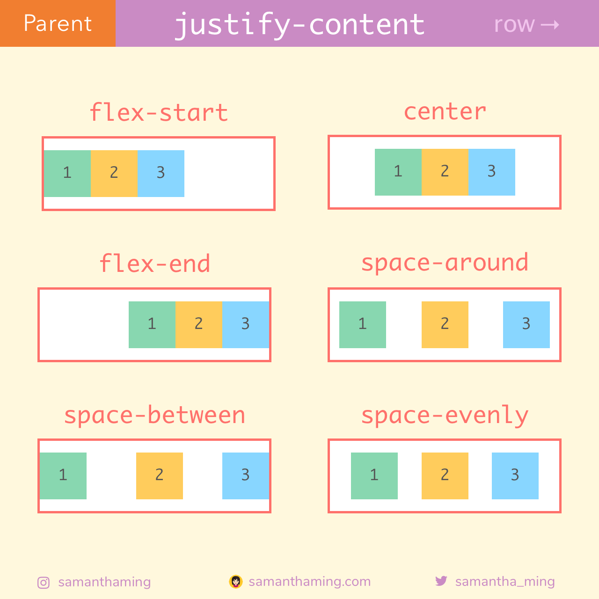</p>

```css
.parent {
  justify-content: flex-start /* default */
                or flex-end
                or center
                or space-around
                or space-between
                or space-evenly
}
```

<a id="justify-content-column"></a>

### [Day 13: justify-content [column]](#justify-content-column)

The main axis can also lie vertically. In that case, flex-direction is set to `column`. Here's how the flex items will be aligned in that instance.

<p>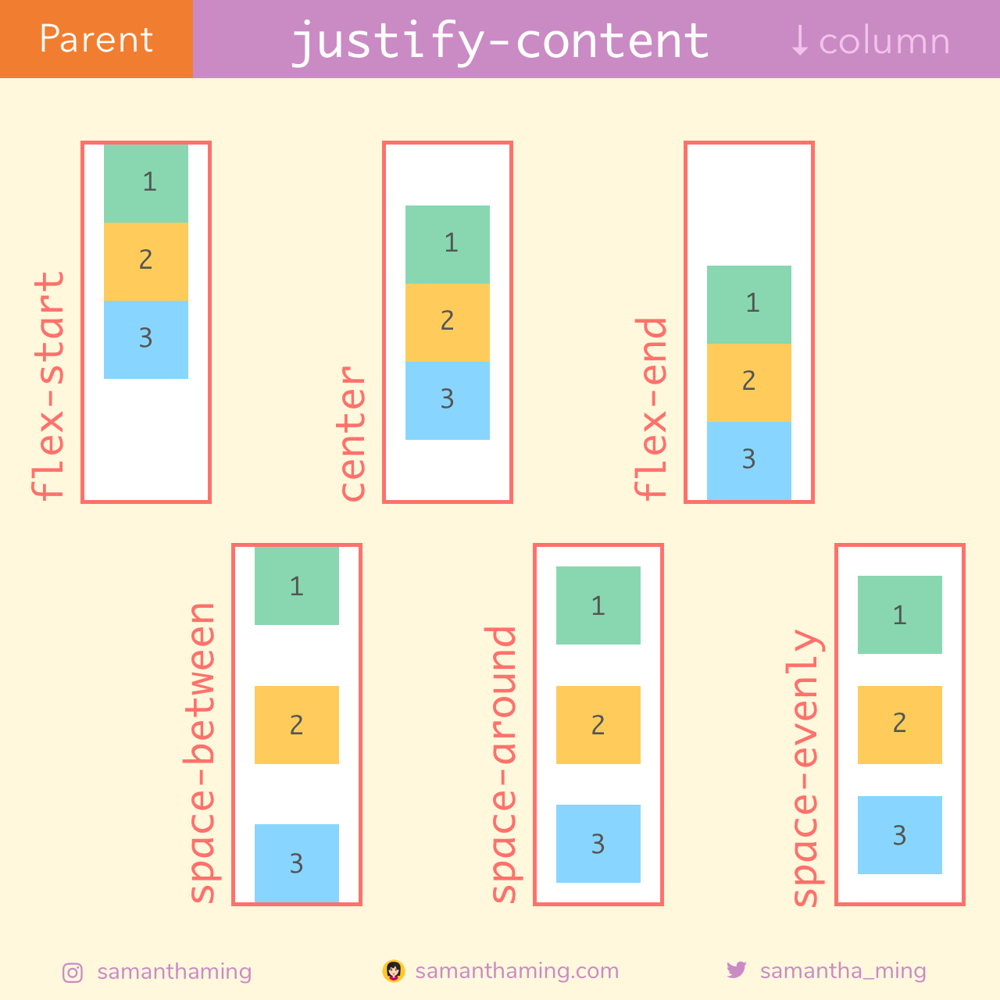</p>

```css
.parent {
  flex-direction: column;
  
  justify-content: flex-start /* default */
                or flex-end
                or center
                or space-around
                or space-between
                or space-evenly
}
```

<a id="space-around-vs-space-evenly"></a>

### [Day 14: space-around vs space-evenly](#space-around-vs-space-evenly)

You might not notice the subtle difference between space-around and space-evenly. So let's talk about it. In `space-evenly`, the empty space in between the flex items is always equal. However, in `space-around`, only the inner items will have equal spacing in between each other. The first and last item will only be allocated half the spacing. Giving the visual appearance of it being more spread out. One may say these folks like to live life on the edge 😂

<p>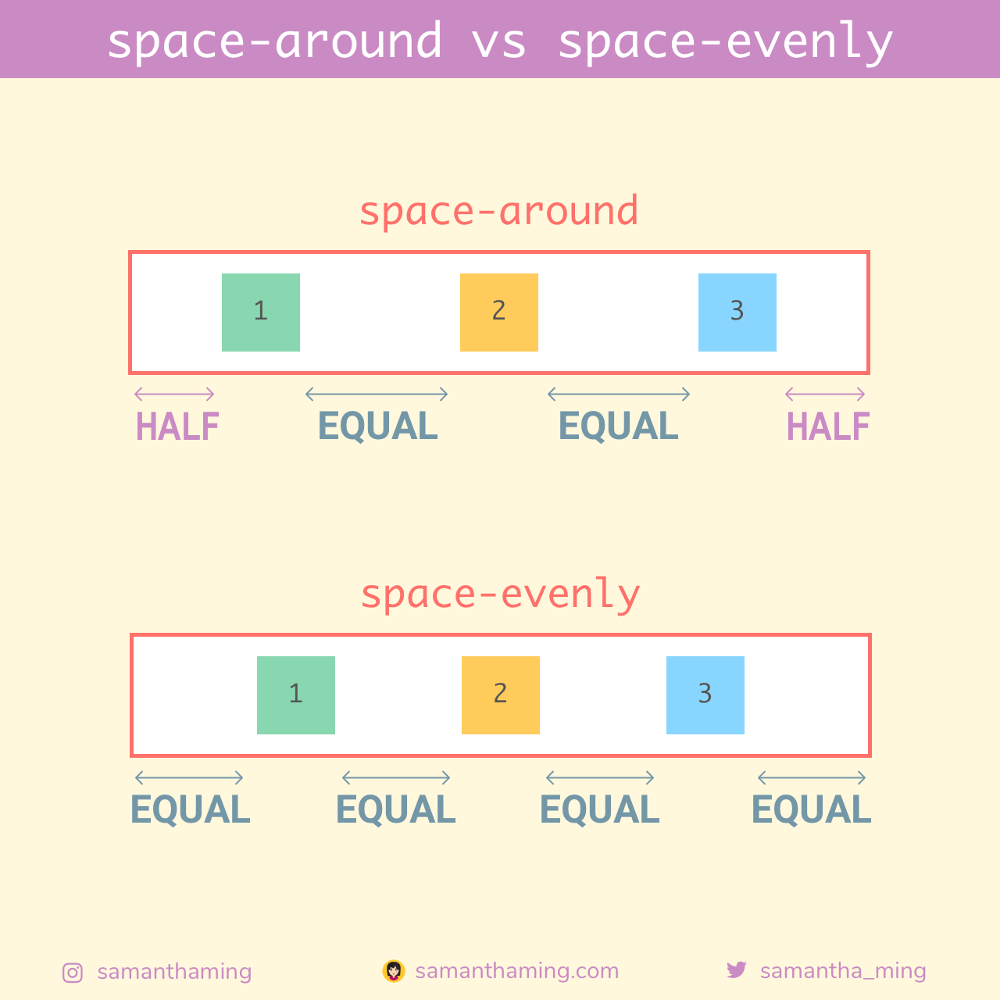</p>

<a id="align-items-row"></a>

### [Day 15: align-items [row]](#align-items-row)

So justify-content controls how items are laid out on the main axis. What about their layout in the cross axis? Don't worry, that's where `align-items` come into play. Remember the cross axis is always perpendicular to the main axis. So if the main axis is sitting horizontally, where flex-direction is `row`. Then , the cross axis is sitting vertically. Aren't you glad we spend almost a week on the fundamentals, that knowledge is all being applied now 🤓

<p></p>

```css
.parent {
  align-items: stretch /* default */
            or flex-start
            or flex-end
            or center
            or baseline
}
```

<a id="baseline"></a>

### [Day 16: baseline](#baseline)

The baseline value is a bit tricky. So let's make sure we understand what that is. Baseline has to do with typography or text. It is the imaginary line where the text sits. If you have the same font size, you really don't visually see a difference. However when you have different font sizes, then the text seems all over the place because the baseline is off. The way to ensure a uniform baseline where all the different sizes of text can rest on is to use the `baseline` value 👍

<p></p>

<a id="align-items-column"></a>

### [Day 17: align-items [column]](#align-items-column)

Now let's take a look at how our flex items are aligned if the cross axis is sitting horizontally. In other words, flex-direction is `column`.

<p>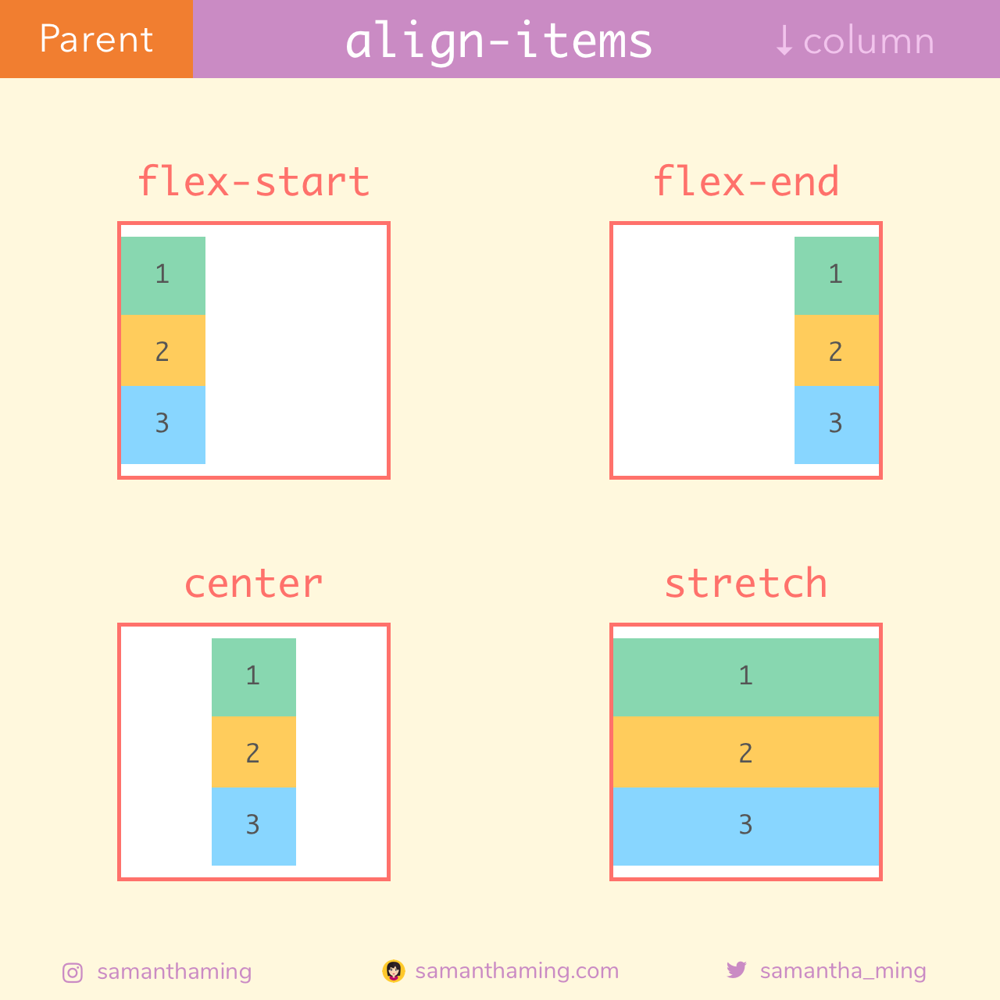</p>

```css
.parent {
  flex-direction: column;
  
  align-items: stretch /* default */
            or flex-start
            or flex-end
            or center
            or baseline
}
```

<a id="align-content"></a>

### [Day 18: align-content](#align-content)

Remember we had `flex-wrap` where we allow flex items to wrap on separate lines. Well, with `align-content` we can control how those row of items are aligned on the cross axis. Since this is only for wrapped items, this property won't have any effect if you only have a singular line of flex items.

<p>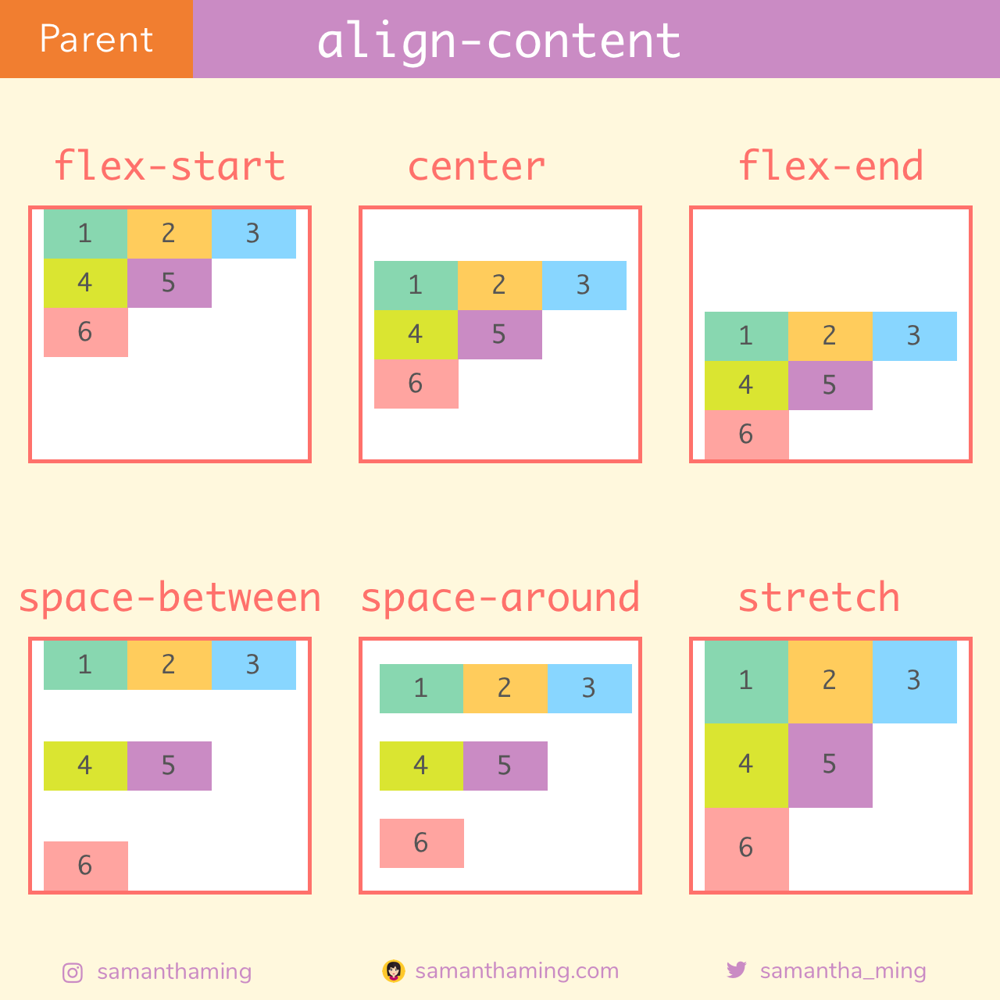</p>

```css
.parent {
  align-content: stretch /* default */
              or flex-start
              or flex-end
              or center
              or space-between
              or space-around
}
```

**[⬆ back to top](#table-of-contents)**

## Child Properties

<a id="child-properties"></a>

### [Day 19: Child Properties](#child-properties)

Yay, you did it! We made it through the parent properties. Up next, let dig into the child properties. Take a breather today, tomorrow we go full speed again 🏎

<p>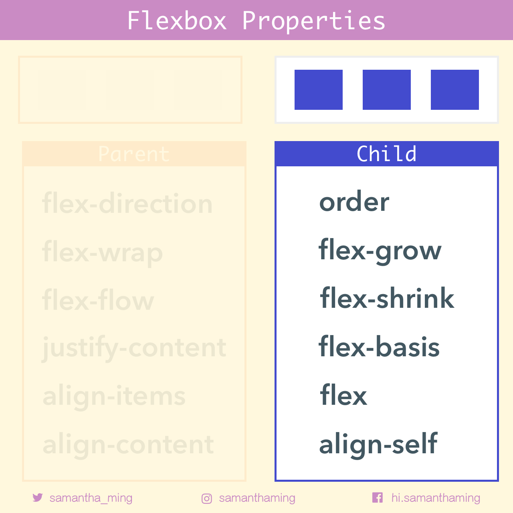</p>

<a id="order"></a>

### [Day 20: order](#order)

By default, flex items are displayed in the same order they appear in your code. But what if you want to change that? No problem! Use the `order` property to change the ordering of your items 🔢

<p>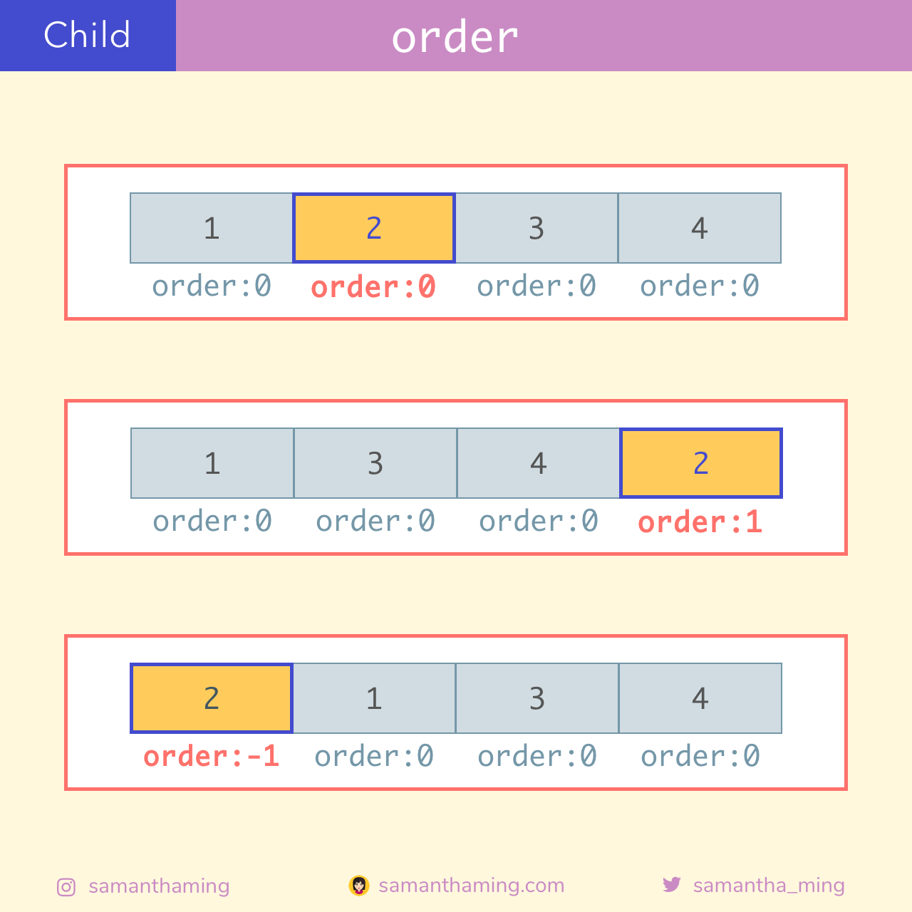</p>

```css
.child {
  order: 0 /* default */
      or <number>
}
```

<a id="flex-grow"></a>

### [Day 21: flex-grow](#flex-grow)

I mentioned in the beginning that Flexbox is great for responsive design. This is where it shines. The `flex-grow` property allows our flex item to grow if necessary. So if there is extra free space in my container, I can tell a particular item to fill it up based on some proportion. That's pretty nuts! When I was learning CSS, I remember everything is pretty static. Now with this property, it's like it has its own brain and it will adjust its size depending on the container. That's so great. I don't have to monitor the size. It will adjust accordingly. This was a quite the mind blow for me 🤯

<p></p>

```css
.child {
  flex-grow: 0 /* default */
          or <number>
}
```

<a id="flex-grow-calculation"></a>

### [Day 22: flex-grow calculation](#flex-grow-calculation)

Being able to grow and fill the free space is pretty cool. Because we don't set the final width of our flex item, the size it grows to always seem so random to me. So let's look at the math. Honestly you don't need to know this to understand Flexbox. The browser takes care of this automatically for you. But knowing what's behind this sorcery might demystify this process and help you understand it better. It's like once you know the trick to the magic, you're no longer tricked by the magic 😉

<p>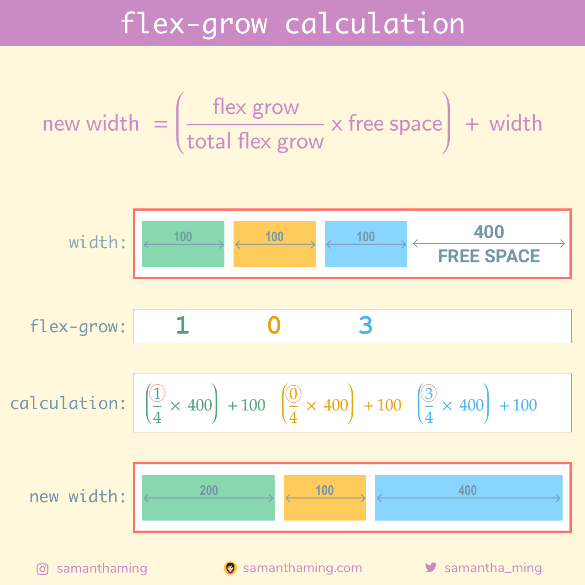</p>

<details>
  <summary><b>Expand to see the calculation</b></summary><br>

I know it can be quite overwhelming to see all numbers crammed into a tidbit. So let's walk through the calculation 👍

Here's the `HTML` and `CSS` we're working with:

_HTML_

```html
<div class="parent">
  <div class="child green"></div>
  <div class="child yellow"></div>
  <div class="child blue"></div>
</div>
```

_CSS_

```css
.parent {
  width: 700px;
}
.child {
  width: 100px;
}
.green {
  flex-grow: 1;
}
.yellow {
  flex-grow: 0;
}
.blue {
  flex-grow: 3;
}
```

<br>

**Step 1: Breaking down the variables**

Here's the formula:

```code
new width = ( (flex grow / total flex grow) x free space) + width
```

Let's extract the variables required in the formula to this handy table we can fill in as we go:

Variables  |     |
---        | --- |
flex grow  | *provided from css*
total flex | *need to calculate*
free space | *need to calculate*
width      | *provided from css*

<br>

**Step 2: Fill in what we know**

From the `CSS` value, we can conclude the following:

- Each child element has a width `100`
- The parent element (container) has a width of `700`
- The child has a `flex-grow` of `1`, `0`, `3`

Let's update our chart with this information:

<i></i>    |  Green | Yellow | Blue
---        | ---    | ---    | --- |
flex grow  | 1      | 0      | 3
total flex |
free space |
width      | 100    | 100    | 100

<br>

**Step 3: Calculate "free space"**

This is the formula:

```code
free space = parent width - total children widths
```

Remember what we know:

- Each child element has a width `100`
- The parent element (container) has a width of `700`

Great, we can use that information to calculate "total children widths":

```code
total children widths = green + yellow + blue
                      = 100   + 100    + 100

=> 300
```

Now we can calculate our "free space":

```code
free space = parent width - total children widths
           = 700          -  300

=> 400
```

Let's update our chart and add these additional information:

<i></i>    |  Green | Yellow | Blue | Total
---        | ---    | ---    | ---  | --- |
flex grow  | 1      | 0      | 3
total flex |
free space | -      | -      | -    | **400**
width      | 100    | 100    | 100

<br>

**Step 4: Calculate "total flex grow"**

This is an easy one, we simply add up our total `flex-grow`:

```code
total flex grow = green + yellow + blue
                = 1     + 0      + 3

=> 4
```

Fill in our chart and Voilà! We have all the information we need for the final calculation 👍

<i></i>     |  Green | Yellow | Blue | Total
---         | ---    | ---    | ---  | --- |
flex grow   | 1      | 0      | 3    | **4**
free space  | -      | -      | -    | 400
width       | 100    | 100    | 100  |

<br>

**Final step: Calculate "new width"**

Remember the formula:

```code
new width = ( (flex grow / total flex grow) x free space) + width
```

_a. Green_

```code
new width = ( (1/4 * 400) ) + 100

=> 200
```

_b. Yellow_

```code
new width = ( (0/4 * 400) ) + 100

=> 100
```

_c. Blue_

```code
new width = ( (3/4 * 400) ) + 100

=> 400
```

Done! We have successfully calculated the new width 🥳

<i></i>       |  Green   | Yellow  | Blue    | Total
---           | ---      | ---     | ---     | --- |
width         | 200      | 100     | 400  
flex grow     | 1        | 0       | 3       | 4
free space    |          |         |         | 400
**new width** | **200**  | **100** | **400**  

<hr>

</details>

<a id="flex-shrink"></a>

### [Day 23: flex-shrink](#flex-shrink)

So `flex-grow` will expand to fill the extra space if there are any. The opposite of that is `flex-shrink`. What happens when you run out of space. This is the property that controls how much your flex items will shrink to fit. Note the larger the number, the more it will shrink 👍

<p></p>

```css
.child {
  flex-shrink: 1 /* default */
            or <number>
}
```

<a id="flex-shrink-calculation"></a>

### [Day 24: flex-shrink calculation](#flex-shrink-calculation)

This is another optional knowledge. But if you're like me and is curious how the browser calculates flex-shrink. Join me in this rabbit hole 🐰

The math behind `flex-shrink` is a bit more complicated then `flex-grow`. You need to take into account of it's existing proportion and shrink it accordingly to the flex shrink amount. Hence, a few more calculation involved. Again, if this is throwing you off. Skip it. You don't need to know this to understand Flexbox. Luckily the browser takes care of it for you, how wonderful 😌

<p>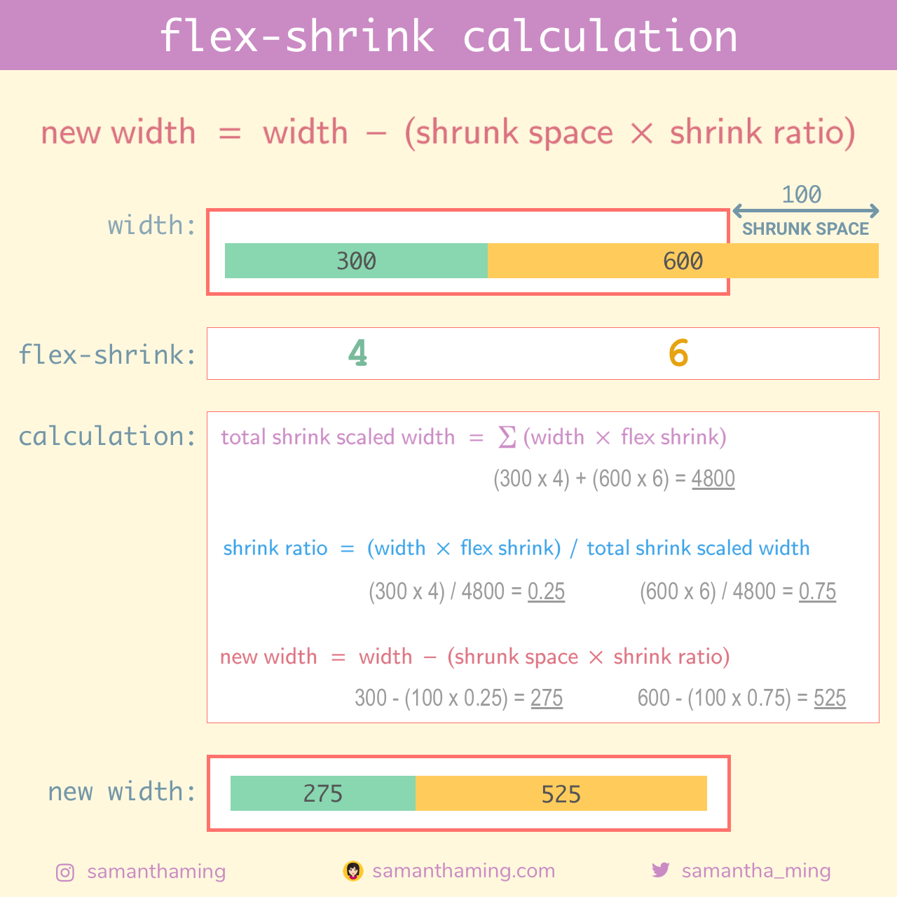</p>

<details>
  <summary><b>Expand to see the calculation</b></summary><br>

Indeed the calculation is a bit more complicated. But no worries, let's break it down we go through it step by step, you got this 💪

Here's the `HTML` and `CSS` we're working with:

_HTML_

```html
<div class="parent">
  <div class="green"></div>
  <div class="yellow"></div>
</div>
```

_CSS_

```css
.parent {
  width: 800px;
}
.green {
  width: 300px;
  flex-shrink: 4;
}
.yellow {
  width: 600px;
  flex-shrink: 6;
}
```

<br>

**Step 1: Breaking down the variables**

This is the formula:

```code
new width = width - (shrink space x shrink ratio)
```

Let's extract the variables required in the formula to this handy table we can fill in as we go:

Variables    |     |
---          | --- |
width        | *need to calculate*
shrink space | *need to calculate*
shrink ratio | *need to calculate*

<br>

**Step 2: Fill in what we know**

From the `CSS` value, we can conclude the following:

- The parent element (container) has a width of `800`
- Green child element has a width `300` and `flex-shrink` of `4`
- Yellow child element has a width `600` and `flex-shrink` of `6`

Let's update our chart with this information:

<i></i>     |  Green | Yellow |
---         | ---    | ---    |
flex shrink | 4      | 6
width       | 300    | 600

<br>

**Step 3: Calculate "shrunk space"**

This is the formula:

```code
shrunk space = total children widths - parent width
```

Remember what we know:

- The parent element (container) has a width of `800`
- The child elements has a width of `300`, `600`

Great, we can use that information to calculate "total children widths":

```code
total children widths = green + yellow
                      = 300   + 600

=> 900
```

Now we can calculate our "shrunk space":

```code
shrunk space = total children widths - parent width
             = 900                   -  800

=> 100
```

Let's update our chart and add the additional information:

<i></i>      |  Green | Yellow | Total
---          | ---    | ---    | --- |
flex shrink  | 4      | 6
width        | 300    | 600
shrunk space | -      | -      | **100**

<br>

**Step 4: Calculate "shrink ratio"**

This is the formula:

```code
shrink ratio = (width x flex shrink) / total shrink scaled width
```

Notice this new variable, `total shrink scaled width`. So we need to calculate that first to get our shrink ratio.

<br>

**Step 4-1: Calculate "total shrink scaled width"**

This is the formula:

```code
total shrink scaled width = Σ(width x flex shrink)
```

"Σ" Sigma is a math symbol that means the summation of something. So we need to apply `width x flex shrink` for all the child elements.

_Green_

```code
width x flex shrink = 300 x 4

=> 1200
```

_Yellow_

```code
width x flex shrink = 600 x 6

=> 3600
```

_Finally_

```code
total shrink scaled width = 1200 + 3600

=> 4800
```

Let's add this information to our chart:

<i></i>                   |  Green | Yellow | Total
---                       | ---    | ---    | --- |
flex shrink               | 4      | 6
width                     | 300    | 600
shrunk space              | -      | -      | 100
total shrink scaled width | -      | -      | **4800**

<br>

**Step 4-2: Back to calculating "shrink ratio"**

Fantastic, now that we know the "total shrink scaled width", we can return with calculating the "shrink ratio". Remember the formula:

```code
shrink ratio = (width x flex shrink) / total shrink scaled width
```

_Green_

```code
shrink ratio = (300 x 4) / 4800

=> 0.25
```

_Yellow_

```code
shrink ratio = (600 x 6) / 4800

=> 0.75
```

Let's add this information to our chart:

<i></i>      |  Green   | Yellow   | Total
---          | ---      | ---      | --- |
flex shrink  | 4        | 6
width        | 300      | 600
shrunk space | -        | -        | 100
shrink ratio | **0.25** | **0.75**

<br>

**Final step: Calculate "new width"**

Remember the formula:

```code
new width = width - (shrink space x shrink ratio)
```

_Green_

```code
new width = 300 - (100 x 0.25)

=> 275
```

_Yellow_

```code
new width = 600 - (100 x 0.75)

=> 525
```

Done! We have successfully calculated the new width 🥳

<i></i>       |  Green   | Yellow
---           | ---      | ---     |
width         | 300      | 600
shrunk space  | 4        | 6
shrink ratio  | 0.25     | 0.75
**new width** | **275**  | **525**

<hr>
</details>

<a id="flex-basis"></a>

### [Day 25: flex-basis](#flex-basis)

With the flex-grow and flex-shrink property, we know the flex size changes. With the `flex-basis` property, this is where we set its initial size. You can think of this property as the width of our flex items. So your next question might be what's the difference between width and flex-basis. Of course, you can still use width and it will still work. The reason it works is because if you didn't set the flex-basis, it will default to the width. So your browser will always try to find the `flex-basis` value as the size indicator. And if it can't find it, then it has no choice but to go with your width property.  Don't make the browser do extra work. Do it the proper flex way and use `flex-basis`.

You may notice I referenced width in my previous formulas. That's because I had not cover flex-basis at that point. So if we want to be **flex** correct, please replace where I mentioned width with flex-basis 😝

<p>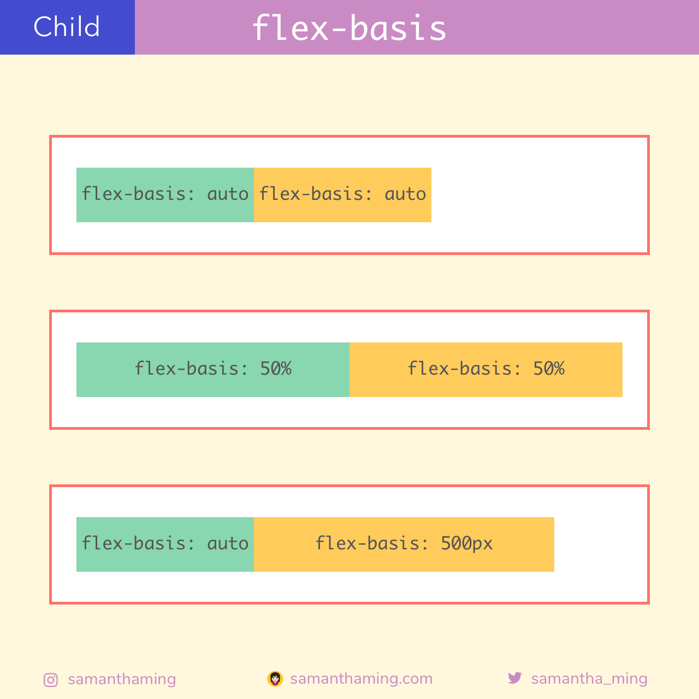</p>

```css
.child {
  flex-basis: auto /* default */
           or <width>
}
```

Valid width values are absolute [`<length>`](https://developer.mozilla.org/en-US/docs/Web/CSS/length) and [`<percentage>`](https://developer.mozilla.org/en-US/docs/Web/CSS/percentage). You can see some examples and read more on MDN web docs:

- [`MDN: <length>`](https://developer.mozilla.org/en-US/docs/Web/CSS/length)
- [`MDN: <percentage>`](https://developer.mozilla.org/en-US/docs/Web/CSS/percentage)

<a id="flex-basis-vs-widths"></a>

### [Day 26: flex-basis vs widths](#flex-basis-vs-widths)

Here you can see very clearly that when an item has a flex-basis and a width. The browser will always use the value set with `flex-basis` . Again, another reason to use the proper flex way 😉

But watch out, if you also set a `min-width` and `max-width`. In those cases, `flex-basis` will lose and will not be used as the width.

<p>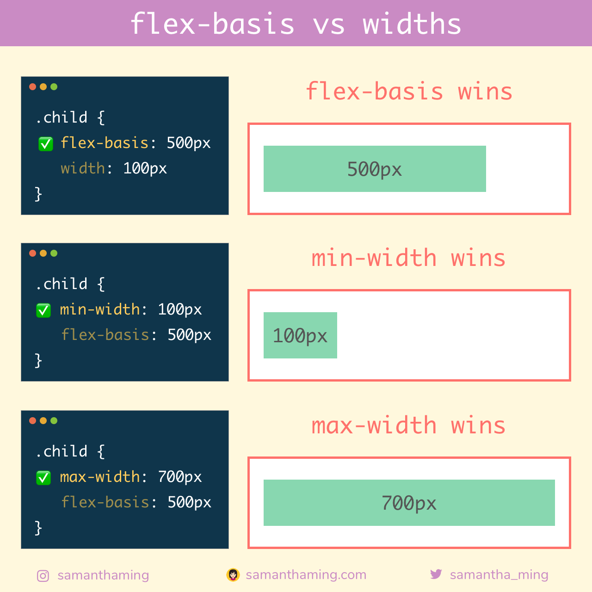</p>

<a id="flex"></a>

### [Day 27: flex](#flex)

Sometimes, setting `flex-grow`, `flex-shrink` and `flex-basis` separately are tiring. Well, don't you worry. For the lazy programmers, I mean the efficient programmers 😜  You can set all 3 with the `flex` shorthand. The added bonus of this way is you don't have to set all 3 value, you can skip the properties you're not interested in and just set the one you are. And for the ones you skipped, it will just take on the default value. Awesome 👍

<p>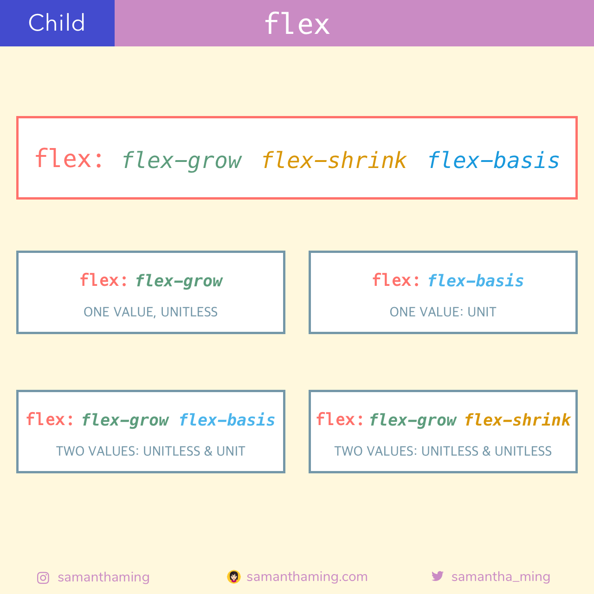</p>

```css
.child {
  flex: 0 1 auto /* default */
     or <flex-grow> <flex-shrink> <flex-basis>
     or <flex-grow>
     or <flex-basis>
     or <flex-grow> <flex-basis>
     or <flex-grow> <flex-shrink>
}
```

<a id="align-self"></a>

### [Day 28: align-self](#align-self)

Remember our `align-items` property where we can set the flex item along the cross axis. The thing with `align-items` is that it forces ALL of the flex items to play with the rules. But what if you want one of them to break the rule. No worries, for  you independent thinkers, you can use `align-self`. This property accepts all of the same values given to `align-items`, so you can easily break from the pack 😎

<p>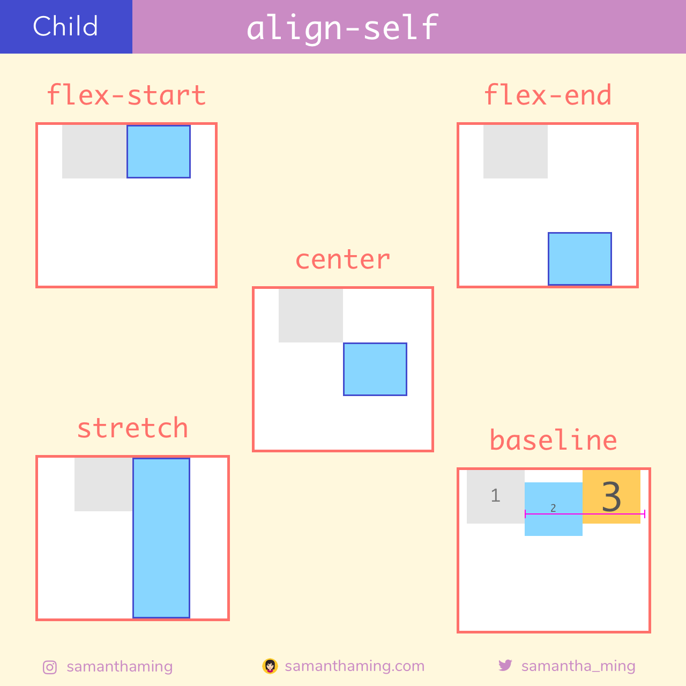</p>

```css
.child-1 {
  align-self: stretch /* default */
           or flex-start
           or flex-end
           or center
           or baseline
}
```

## Summary

<a id="flexbox-properties"></a>

### [Day 29: Flexbox Properties](#flexbox-properties)

YAY!!! You did it! You learned all the properties of Flexbox! You're a Flexbox ninja now! We covered a lot in this short amount of time. Go back and re-visit the ones you still don't understand. Don't just read my Flexbox lessons. Check out other Flexbox tutorials. Sometimes reading a different perspective will help solidify your knowledge and fill in any gaps. Remember the best way to get better is to apply. I gave you the knowledge, now it's on YOU to apply and build something with it 💪

<p></p>

<a id="flexbox-cheatsheet"></a>

### [Day 30: Flexbox Cheatsheet](#flexbox-cheatsheet)

Final tidbit! Let me give you one more tidbit for the road. Memorizing all the available properties is not easy. Even after doing creating this entire tutorial, I still don't have all these properties memorized. Being a good programmer is not about how much you memorize, it's about problem solving. And that's why it's important for a programmer to continue to stay humble and learn. It's all about expanding our toolkit so when we do face a problem, we have a variety of tools that we can select from to fix it 🧰

Congratulation for completing Flexbox30! I hope you learned a lot and thank you for letting my tidbits be part of your programming journey 💛

<p></p>

**[⬆ back to top](#table-of-contents)**

<a id="auto-margins"></a>

### [Bonus: Aligning with Auto Margins](#auto-margins)

Bonus content! Another way to align Flexbox child elements is to use auto margins. Although this isn't a Flexbox property, it's still important to be aware of it because it has a very interesting relationship with Flexbox. Check out my code notes on it if you're interested  👉 [Flexbox: Aligning with Auto Margins](/flexbox-aligning-with-auto-margins/README.md)

<p>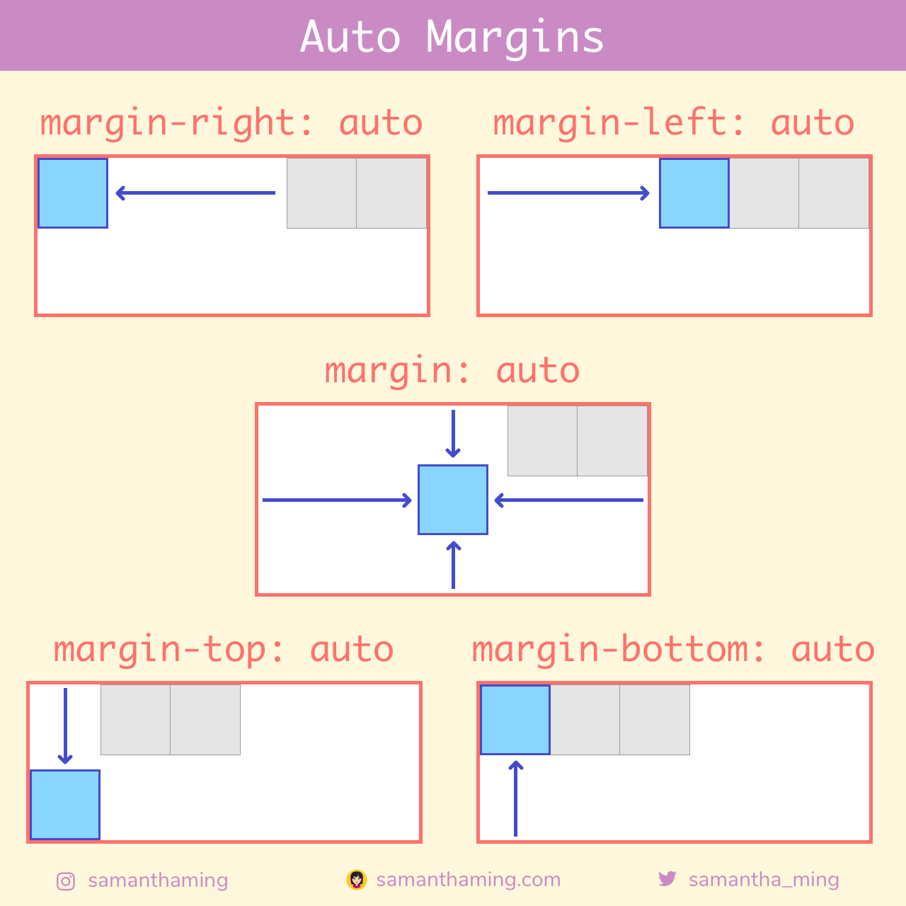</p>

<a id="resources"></a>

## 📚 Resources

**Learning Flexbox**

- [MDN web docs: Flexbox](https://developer.mozilla.org/en-US/docs/Learn/CSS/CSS_layout/Flexbox)
- [MDN web docs: Basic Concepts of flexbox](https://developer.mozilla.org/en-US/docs/Web/CSS/CSS_Flexible_Box_Layout/Basic_Concepts_of_Flexbox)
- [CSS-Tricks: A Complete Guide to Flexbox](https://css-tricks.com/snippets/css/a-guide-to-flexbox/)
- [Yoksel: Flex Cheatsheet](https://yoksel.github.io/flex-cheatsheet/)
- [JoniBologna.com: Flexbox Cheatsheet](http://jonibologna.com/flexbox-cheatsheet/)
- [Interneting is hard: Flexbox](https://internetingishard.com/html-and-css/flexbox/)

**Official Spec**

- [W3C: Flexbox](https://www.w3.org/TR/css-flexbox-1/)

**Community Suggestion**

- [Flexbox Zombies](https://flexboxzombies.com) $
- [Flexbox Froggy](https://flexboxfroggy.com/)
- [Wes Bos: What the Flexbox?!](https://flexbox.io/)

<a id="say-hello"></a>

## 👋 Say Hello

> I share JS, HTML, CSS tidbits every week!

Twitter: [@samantha_ming](https://twitter.com/samantha_ming)  
Instagram: [@samanthaming](https://www.instagram.com/SamanthaMing/)  
Facebook: [@hi.samanthaming](https://www.facebook.com/hi.samanthaming/)  
Medium: [@samanthaming](https://medium.com/@samanthaming)  
Dev: [@samanthaming](https://dev.to/samanthaming)  
Official: [samanthaming.com](https://www.samanthaming.com/)

<a id="download-and-share"></a>

## 💖 Download & Share

Absolutely! You are more than welcome to download and share my code tidbits. If you've gotten any value from my content and would like to help me reach more people, please do share!

One thing that I kindly ask is that you don't edit the images or crop my name out. Please leave the images intact. Thank you for choosing to do the right thing 😇

<a id="contribution"></a>

## 🌟 Contribution

~~Yes! Anyone is welcome to contribute to the quality of this content. Please feel free to submit a PR request for typo fixes, spelling corrections, explanation improvements, etc. If you want to help translate the tutorial, that's even cooler! I'm hoping to at least create a Chinese version soon 👩🏻‍🏫~~

(Note: all updates will now appear in the new repo: https://github.com/samanthaming/samanthaming.com)

**[⬆ back to top](#table-of-contents)**

<a id="license"></a>

## 👩🏻‍⚖️ License

Thank you for wanting to share and include my work in your project 😊 If you're wondering how to provide attributions. It simply means don't edit the images. There is attribution automatically built into them. Easy peasy right! So you don't have to provide additional attribution when you share the images ⭐️

<a rel="license" href="http://creativecommons.org/licenses/by-nc-nd/4.0/"></a><br />This work is licensed under a <a rel="license" href="http://creativecommons.org/licenses/by-nc-nd/4.0/">Creative Commons Attribution-NonCommercial-NoDerivatives 4.0 International License</a>.

**[⬆ back to top](#table-of-contents)**
