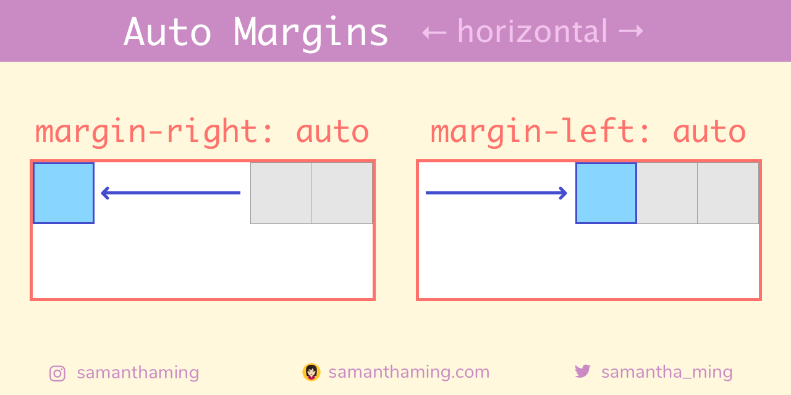
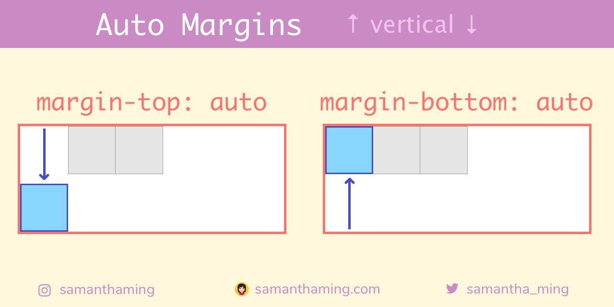
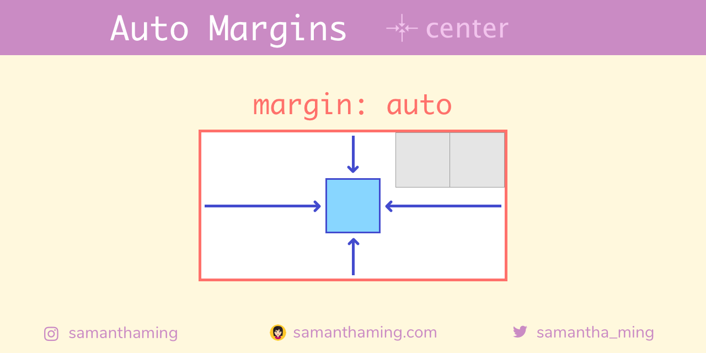
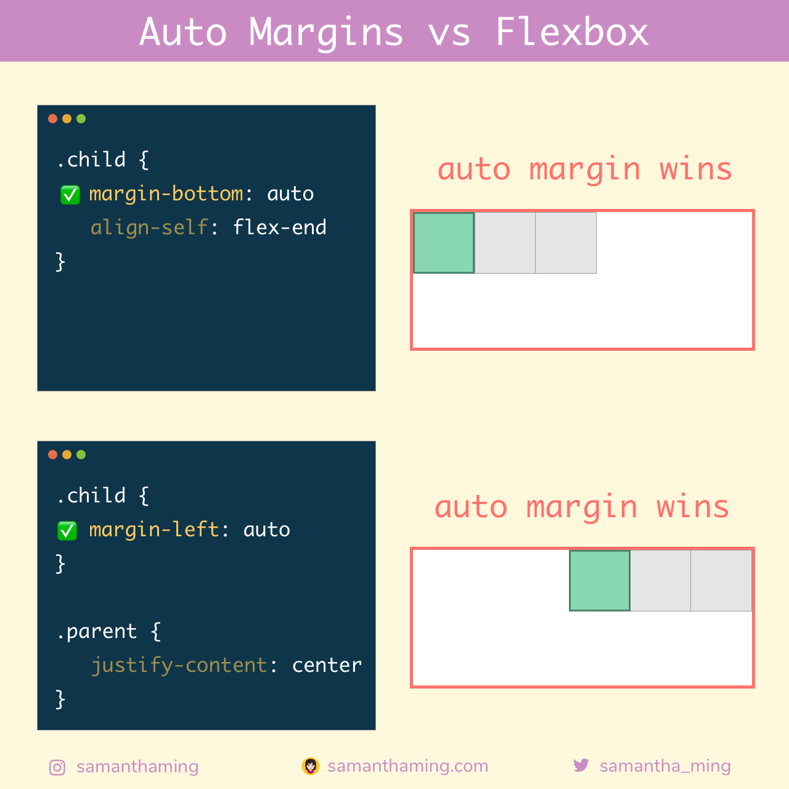

# Flexbox: Alineación con márgenes automáticos

Aprendiste que `align-self` te da el control del elemento hijo en el eje transversal. Su próxima pregunta podría ser "¿hay algo similar para el eje principal" 🤔 ¡Gran pregunta! Lamentablemente, la respuesta es NO 😅. ¡Pero tenemos una propiedad CSS existente que podemos usar! Y eso es **márgenes automáticos**. Podemos usarlo para controlar la alineación horizontal de un elemento específico.

<p></p>

En realidad, también puede usar **márgenes automáticos** para controlar la alineación vertical de un elemento específico.

<p></p>

Y si aplica todos los márgenes (left, right, top, bottom) con la abreviatura `margins`. ¡En realidad centras a ese hijo en particular en la dirección horizontal y vertical!

<p></p>

## Entendiendo Margin

Recuerda los conceptos básicos de margen. Agrega **espacio** al elemento. Entonces, con `margin-left: 50px`, agrega un valor de `50px` de espacio a la izquierda del elemento. Lo que empuja el elemento hacia la derecha. Con `margin-left: auto`, el `auto` calcula todo el espacio disponible y lo convierte en la cantidad de espacio a la izquierda del elemento. Lo que empuja el elemento completamente hacia la derecha.

<p></p>

| margin          | espacio                            | apariencia                                 |
|-----------------|------------------------------------|--------------------------------------------|
| `margin-left`   | agrega espacio a la izquierda      | empuja el elemento hacia la derecha        |
| `margin-right`  | agrega espacio a la derecha        | empuja el elemento hacia la izquierda      |
| `margin-top`    | agrega espacio a la parte superior | empuja el elemento hacia la parte superior |
| `margin-bottom` | agrega espacio a la parte inferior | empuja el elemento hacia la parte inferior |
| `margin`        | agrega espacio alrededor           | empuja el elemento hacia el centro         |

## Los márgenes automáticos siempre ganan 🏆

Si usa **márgenes automáticos**, reinará supremamente y sus propiedades de alineación de Flexbox no tendrán efecto 💪

<p></p>

**¿Por qué?**

> Nota: Si el espacio libre se distribuye a los márgenes automáticos, las propiedades de alineación no tendrán efecto en esa dimensión porque los márgenes habrán robado todo el espacio libre restante después de flex

En términos no de desarrollo, los **márgenes automáticos** es ese amigo despistado al que invitó amablemente a quedarse en su casa y luego piensan que toda la casa es suya y se hace cargo de todo el espacio. ¿No? No tienes ese tipo de amigo. Yo tampoco 😳 Pero creo que entiendes el punto 😂

## Ejemplos de márgenes automáticos

¡Aquí hay algunos ejemplos donde los **márgenes automáticos** realmente brillan! Es genial diseñar su navbar en el estilo que prefiera 🤩

<p></p>

## ¿Cuál debería usar 🤔

Apuesto a que tu cabeza está girando ahora para usar qué y cuándo usar qué (el problema de tener varias opciones) 😅 . Así es como lo hago:

1. Utilice siempre las propiedades **Flexbox**
2. Si no es posible, use **márgenes automáticos**

¿Razonamiento? Creo que las propiedades de Flexbox son más intuitivas y se leen más explícitamente que los "márgenes automáticos". Revisalo:

```css
.hijo {
  align-self: flex-end;
}
```

**vs**

```css
.hijo {
  margin-top: auto;
}
```

Incluso si no tienes ningún conocimiento de Flexbox. Solo lea este código, puede concluir que el `hijo` se está alineando hasta el _final_. Sin embargo, con la opción `margin-top: auto`, estás girando un poco la cabeza con cómo se ve exactamente eso. Por supuesto, esta es solo mi recomendación. Siéntase libre de hacer lo que funcione para usted y su equipo 😊

## Recursos

- [W3C Flexbox Spec: Aligning with auto margins](https://www.w3.org/TR/css-flexbox-1/#auto-margins)
- [Hackernoon: Flexbox's Best-Kept Secret](https://hackernoon.com/flexbox-s-best-kept-secret-bd3d892826b6)
- [CSS Tricks: The peculiar magic of flexbox and auto margins](https://css-tricks.com/the-peculiar-magic-of-flexbox-and-auto-margins/)
- [Stack Overflow: Why are there no "justify-items" and "justify-self" properties?](https://stackoverflow.com/questions/32551291/in-css-flexbox-why-are-there-no-justify-items-and-justify-self-properties/33856609#33856609)
- [Stack Overflow: Can't scroll to top of flex item that is overflowing container](https://stackoverflow.com/questions/33454533/cant-scroll-to-top-of-flex-item-that-is-overflowing-container)
